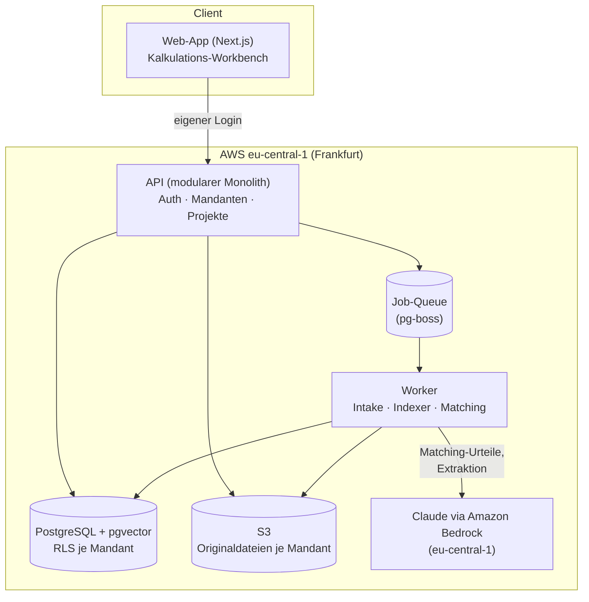

# Kalkulations-Assistent — Ziel-Architektur

**Produkt:** SaaS für mittelständische Bauunternehmen: Ausschreibung/LV in **beliebigem Format**
hochladen (GAEB, Excel, PDF, Word, formlose Anfrage) → Kalkulationsentwurf mit Preisvorschlägen
aus der eigenen Angebots-/Nachkalkulations-Historie, jeder Vorschlag mit Quellenverweis →
Export nach Excel/GAEB. (Phase-1-Durchstich aus dem SaaS-Plan; Strategiekontext:
`2026-07-24-galant-second-brain-dsgvo.md`.)

**Stand:** 24.07.2026 · Verfasst als Zielbild für den MVP-Bau; MVP-Schnitt in Abschnitt 11.

---

## 1. Architektur-Leitplanken (nicht verhandelbar)

1. **EU-Residenz by design.** Alles läuft in AWS eu-central-1 (Frankfurt): App, Datenbank,
   Dateispeicher, Vektorindex — und die Claude-Aufrufe über **Amazon Bedrock** (Prompts/Outputs
   werden dort nicht gespeichert, nicht trainiert, nicht an den Modellanbieter weitergegeben;
   AVV mit AWS). Das ist das Verkaufsargument gegen jedes US-Tool und erspart die
   Drittland-Diskussion beim Kunden.
2. **Das LLM wählt und begründet — der Code rechnet.** Preisableitungen (Indexierung,
   Mengenstaffeln, Einheitenumrechnung, Zuschläge, Summen) laufen ausschließlich in
   deterministischem Code. Claude entscheidet, *welche* Altposition passt, und begründet es —
   nie, *was* etwas kostet. (Bewährtes Command-Center-Prinzip: `compute.ts`-Regel.)
3. **Kein Vorschlag ohne Quelle.** Jeder Preisvorschlag referenziert eine konkrete Altposition
   (ID). Die Engine verifiziert die Referenz (existiert, Einheit kompatibel); ohne gültige Quelle
   wird die Position als „manuell" markiert statt geraten. Das ist der Halluzinations-Schutz und
   zugleich der Vertrauensanker für den Kalkulator (Gilbane/Trunk-Tools-Lektion).
4. **Formatoffen — kein Format ist Voraussetzung.** GAEB ist der beste Fall, nicht die
   Eintrittskarte. Excel-Kalkulierer ohne AVA-Software sind ausdrücklich Zielgruppe (und im
   Mittelstand die Mehrheit). Der Dreh- und Angelpunkt ist das kanonische Positionsschema —
   jedes Eingangsformat wird dahin normalisiert (Abschnitt 5).
5. **Harte Mandantentrennung.** `tenant_id` überall, Postgres Row-Level-Security, S3-Präfix je
   Mandant, kein Cross-Tenant-Learning (vertraglich zusicherbar: „eure Preise bleiben eure").
6. **Korrekturen sind Gold.** Jede Kalkulator-Korrektur fließt als Ereignis ins Preisgedächtnis
   zurück — das ist der Lock-in und der Qualitäts-Loop.

## 2. Prozessabdeckung — wo der Assistent im KMU-Kalkulationsablauf sitzt

So läuft Angebotskalkulation in einem typischen Bau-KMU wirklich ab — und das deckt das
Produkt davon ab (ehrliche Karte, Stand V1):

| # | Prozessschritt im KMU | Deckt V1 ab? | Ausbaupfad |
|---|---|---|---|
| 1 | **Anfrage kommt rein** (GAEB, PDF, Excel, E-Mail, Ortstermin) → bieten oder nicht? | 🟡 Intake ja; Bid/No-Bid-Einschätzung nein | „Anfrage-Check": Claude fasst LV zusammen (Umfang, Gewerke, Risiken, Frist) als Entscheidungshilfe — kleines, dankbares Feature |
| 2 | **LV sichten:** Vorbemerkungen/Vertragsbedingungen lesen, Massen plausibilisieren | 🟡 Positionsanalyse ja; Vorbemerkungs-Prüfung nein | „Vorbemerkungs-Check": LLM liest den Vorspann und markiert Risiko-Klauseln (Vertragsstrafen, Stundenlohn-Deckelung, ungewöhnliche Fristen) — Document-Crunch-Muster |
| 3a | **Preise bilden aus Erfahrung/Historie** (der Weg der meisten KMU) | 🟢 **Das Kernprodukt** (Abschnitt 6) | — |
| 3b | **Detailkalkulation:** Material (Lieferantenanfragen), Lohn (Aufwandswert × Mittellohn), Geräte, Nachunternehmer (Anfragen + Preisspiegel) | 🔴 Nicht in V1 | NU-/Lieferanten-Preisspiegel: Anfragen rausschicken, eingehende Angebote (PDF/E-Mail) einlesen und vergleichen — sehr LLM-geeignet, eigenes Modul nach dem MVP |
| 4 | **Zuschläge:** BGK, AGK, Wagnis & Gewinn → Endpreise (Zuschlagskalkulation/Umlage) | 🔴 Nicht in V1 | Deterministisches Zuschlagsmodul (einfache Umlage auf EKT) — reiner Code, kein LLM; macht das Produkt für Excel-Kalkulierer zum vollständigen Angebotswerkzeug |
| 5 | **Angebotsschluss:** Nachlass/Skonto, Angebotsschreiben, Abgabe (X84/PDF/Portal) | 🟡 Excel-Export ja; X84-Export und Angebotsschreiben später | X84-Export; Angebotsschreiben-Generator (Anschreiben aus LV-Daten + Firmenvorlage) |
| 6 | **Nach Auftrag:** Arbeitskalkulation, Nachträge, **Nachkalkulation (Soll-Ist)** | 🟡 Nachkalkulations-*Import* ja (füttert das Preisgedächtnis); Arbeitskalkulation/Nachträge nein | Nachtrags-Assistent (Nachtragspositionen gegen Urkalkulation begründen) — hoher Schmerz, späteres Modul |

**Positionierung daraus:**
- Für Firmen **mit** AVA-Software (ORCA, California, iTWO …) ist das Produkt ein **Zulieferer**:
  LV rein, bepreister Entwurf zurück (Excel/X84) — es ersetzt die AVA nicht und muss es nicht.
- Für Firmen **ohne** AVA — die Excel-Kalkulierer, vermutlich das größere Segment — kann es
  schrittweise zum **leichtgewichtigen Angebotswerkzeug** wachsen: V1 (Preisvorschläge) →
  Zuschlagsmodul → Angebotsschreiben. Gleicher Kern, zwei Segmente.
- **Bewusst nie im Scope:** Mengenermittlung/Aufmaß aus Plänen (CAD-/BIM-Welt, eigenes
  Universum) und der Ersatz einer vollen AVA-Suite.

Der MVP bleibt bei Schritt 3a — aber Datenmodell und Pipeline sind so geschnitten, dass die
Module aus der Tabelle andocken, ohne den Kern umzubauen (alle arbeiten auf demselben
kanonischen Schema und demselben Preisgedächtnis).

## 3. Gesamtbild



Ein deploybarer Monolith + ein Worker-Prozess. Keine Microservices, kein Kubernetes — zwei
Container (App, Worker) auf ECS Fargate reichen bis weit über 100 Kunden.

## 4. Frontend

- **Next.js** (App Router), gehostet mit der API zusammen (kein Vercel — US-Anbieter würde die
  EU-Story verwässern; CloudFront + Fargate).
- **Login: eigene, anbieterneutrale Authentifizierung** — E-Mail/Passwort + Passkeys, verwaltet
  in der eigenen Postgres (z. B. via Auth.js/better-auth oder selbst gehostetem Keycloak). Keine
  Bindung an einen Identity-Anbieter. SSO wird später als **generische OIDC/SAML-Schnittstelle je
  Mandant** angeboten (Enterprise-Feature) — daran kann ein Kunde Entra ID, Google oder seinen
  eigenen IdP hängen, ohne dass das Produkt davon abhängt.
- **Kern-Screen: die Kalkulations-Workbench.** Eine Tabelle, eine Zeile pro LV-Position:
  | OZ | Kurztext | Menge/Einheit | **Vorschlag (EP)** | **Quelle** | **Stufe** | Aktion |
  - *Quelle* verlinkt die Altposition (Projekt, Jahr, damaliger EP) — ein Klick zeigt den
    Originalkontext.
  - *Stufe*: `sicher` (übernehmen), `prüfen` (Kandidat unklar — Alternativen anzeigen),
    `manuell` (keine belastbare Quelle — leeres Feld statt Ratepreis).
  - Aktionen: übernehmen / Alternativkandidat wählen / eigenen Preis eintragen. Jede Aktion ist
    ein Korrektur-Ereignis (→ Abschnitt 8).
- Fortschritt eines Laufs (Einlesen → Matchen → fertig) über Server-Sent Events; ein
  500-Positionen-LV läuft Minuten, nicht Sekunden — die UI muss asynchron gedacht sein.

## 5. Universal-Intake — jedes Format, ein Schema

**Grundsatz: „Alles reinwerfen" (bewährtes Command-Center-Muster).** Der Nutzer lädt hoch, was
er hat; das System erkennt das Format und normalisiert in das **kanonische Positionsschema**:
`{oz, kurztext, langtext, menge, einheit, gewerk, ep, gp, projekt_id, jahr, quelle_typ}`.

| Eingangsformat | Verarbeitung | Max. Stufe |
|---|---|---|
| **GAEB X81/X83/X84** (XML 3.2/3.3) | deterministischer Parser, kein LLM | `sicher` möglich |
| **Excel-LV** (jede Spaltenanordnung) | **Mapping-Assistent:** Claude erkennt Spaltenbedeutungen → Nutzer bestätigt einmal → deterministischer Import. Bestätigte Mappings werden **je Absender/Dateityp gemerkt** — das zweite LV desselben Auftraggebers läuft durch | `sicher` (nach bestätigtem Mapping) |
| **PDF-LV** | Textextraktion (pdftotext-first), Vision nur für Scans → Claude-Extraktion mit Structured Outputs | `prüfen` |
| **Word / formlose Anfrage** (auch E-Mail-Text: „brauchen 200 m Bordstein setzen, 350 m² Pflaster…") | Claude extrahiert eine Positionsliste, Nutzer bestätigt sie | `prüfen` |
| **Foto/Scan** (abfotografiertes LV, handschriftliches Aufmaß) | Vision → Extraktion → Bestätigung | `prüfen` |
| **GAEB 90/2000** (`.d81`/`.d83`-Altformate) | nach Bedarf der Design-Partner nachrüsten | `sicher` möglich |

**Regel: Die Quelle bestimmt die maximale Verlässlichkeits-Stufe.** Geparst (GAEB, bestätigtes
Excel-Mapping) darf `sicher` erreichen; alles Extrahierte (PDF, Word, Foto) ist strukturell
unsicherer und wird höchstens `prüfen` — Mengen und Einheiten aus Extraktion zeigt die
Workbench zur Bestätigung an, bevor gematcht wird.

**Historie-Import (das Onboarding, unterschätzt nicht!):** dieselben Eingangswege gelten für die
Alt-Daten — alte Angebote (X84, Excel, PDF), Nachkalkulationen, Preislisten. Realität im
Mittelstand: Excel-Wildwuchs. Der Import-Assistent ist deshalb **Teil des Produkts**, nicht ein
Skript. Ohne gefüllte Historie ist das Produkt wertlos — der Import entscheidet über den
Time-to-Value.

## 6. Das Preisgedächtnis — Matching-Pipeline (der Kern)

Pro LV-Position läuft eine dreistufige Pipeline:

**Stufe 1 — Kandidaten holen (Retrieval, kein LLM):** Hybrid-Suche über die Historie des
Mandanten: pgvector-Embedding-Ähnlichkeit **plus** Postgres-Volltextsuche **plus** harte Filter
(kompatible Einheit, Gewerk, Mengenband ±). Top 10–20 Kandidaten. Embeddings über ein
Embedding-Modell auf Bedrock (z. B. Titan/Cohere in eu-central-1) — auch hier keine US-Runde.

**Stufe 2 — Urteil (Claude):** Ein Aufruf pro Position mit Structured Output:

```json
{
  "match_quelle_id": "hist_...  | null",
  "stufe": "sicher | pruefen | manuell",
  "begruendung": "1-2 Sätze, für die Workbench-Karte",
  "alternativen": ["hist_...", "hist_..."],
  "anpassungs_hinweise": {"jahr_differenz": true, "mengen_differenz": "groesser"}
}
```

Prompt-Aufbau für maximales Caching (Prefix-Regel!): stabiler System-Prompt + Firmenregeln +
Stammdaten als **gecachter Präfix** (1h-TTL bei Batch-Läufen), die volatile Position + Kandidaten
ans Ende. Kein Zeitstempel, keine IDs im Präfix.

**Stufe 3 — Preis ableiten (Code, deterministisch):** Aus der bestätigten Quelle wird der
Vorschlags-EP errechnet: Baupreisindex-Anpassung (Destatis-Indexreihe je Gewerk, als Stammdaten-
Tabelle gepflegt), optionale Mengenstaffel-Regeln des Mandanten, Einheitenprüfung. Jeder
Rechenschritt wird als Herleitung gespeichert und in der Workbench angezeigt („EP 2023: 41,20 € ×
Index 1,09 = 44,91 €").

**Guards:** referenzierte Quelle muss existieren und einheitenkompatibel sein, sonst → `manuell`;
`sicher` nur bei eindeutigem Kandidaten oberhalb einer Score-Schwelle **und** verlässlicher
Eingangsquelle (Abschnitt 5); das LLM-Urteil kann eine Stufe nie *heraufsetzen*, nur bestätigen
oder senken.

## 7. LLM-Schicht

- **Zugang:** Amazon Bedrock, eu-central-1, über den offiziellen Bedrock-Mantle-Client des
  Anthropic-SDK. Modell-IDs tragen dort das `anthropic.`-Präfix.
- **Modellwahl:** Start mit **Claude Opus** als Standard für die Matching-Urteile — die
  Fehlerkosten einer falschen Zuordnung (falscher Angebotspreis!) rechtfertigen das beste Modell.
  Kostenoptimierung **erst nach Messung**: eindeutige Fälle (ein Kandidat, hoher Score) auf ein
  kleineres Modell stufen, Grenzfälle weiter aufs große — die Pipeline ist dafür schon
  vorbereitet (Stufung ist ein Routing-Feld, kein Umbau). Modellverfügbarkeit neuer Versionen in
  eu-central-1 vor jedem Upgrade prüfen (Bedrock hinkt der First-Party-API teils nach).
- **Structured Outputs** (`output_config.format`, auf Bedrock verfügbar) für alle Urteile und
  Extraktionen — keine JSON-Parsing-Fehler, kein Regex-Gefrickel.
- **Eigene Job-Queue statt Batch-API:** Anthropics Batch-API (50 % Rabatt) gibt es **nicht auf
  Bedrock** — das ist der Preis der EU-Residenz. Die pg-boss-Queue mit kontrollierter
  Parallelität (z. B. 5–10 gleichzeitige Positionen) übernimmt diese Rolle. Bewusste
  Entscheidung, im Dokument festgehalten: Residenz schlägt Rabatt.
- **Kosten-Größenordnung** (Opus-Klasse, mit Caching): pro Position ~1.500 unkachebare
  Input-Token + ~300 Output-Token ≈ 1,5–2 ct → ein 500-Positionen-LV ≈ **5–10 €** Token-Kosten.
  Bei 300–800 €/Monat Zielpreis und wenigen LVs/Woche pro Kunde: unkritisch, aber pro Mandant
  ein Token-Budget mitführen (Kostenkontrolle + Missbrauchsschutz).
- **Beobachtbarkeit:** jede LLM-Interaktion als Zeile in einer `llm_runs`-Tabelle (Mandant,
  Position, Modell, Token, Dauer, Stufe) — reicht für den Anfang; ein Tracing-Tool
  (selbst gehostet) erst, wenn es wehtut.

## 8. Feedback-Loop (der Burggraben)

- Jede Workbench-Aktion erzeugt ein Ereignis: `uebernommen`, `alternative_gewaehlt`,
  `preis_geaendert {alt, neu}`, `stufe_falsch`.
- Angenommene/korrigierte Positionen werden als **neue Einträge** ins Preisgedächtnis
  geschrieben (append-only, versioniert) — die Historie wächst mit jedem Angebot, die Trefferquote
  steigt, der Wechsel zu einem Wettbewerber wird jeden Monat teurer.
- **Nachkalkulations-Import schließt den Kreis:** Soll-Ist-Daten abgeschlossener Projekte
  (auch als Excel) werden denselben Positionen zugeordnet — das Preisgedächtnis kennt dann
  nicht nur den *angebotenen*, sondern den *tatsächlichen* Preis. Das ist der Qualitätssprung
  gegenüber jeder reinen Angebots-Historie.
- **Kein Modell-Training, keine Cross-Tenant-Nutzung.** Später optional: anonymisierter
  Benchmark-Pool („euer Pflaster-EP vs. Marktband") als eigenes, Opt-in-pflichtiges Feature —
  DSGVO-seitig sauber nur mit echter Anonymisierung, nicht im MVP.

## 9. Datenmodell (Kern-Tabellen)

| Tabelle | Inhalt |
|---|---|
| `tenants`, `users` | Mandanten, Nutzer (eigene Konten; optionales SSO-Subject je Mandant), Rollen |
| `projects` | ein LV-Vorgang (Upload → Kalkulation → Export) |
| `lv_positions` | eingelesene Positionen des aktuellen LV (inkl. `quelle_typ` + Roh-Referenz) |
| `history_positions` | das Preisgedächtnis (kanonisches Schema + Embedding + Volltext-Spalte; Angebots- **und** Nachkalkulations-Preise) |
| `matches` | Vorschlag je Position: Quelle, Stufe, Begründung, Herleitung, Status |
| `events` | Korrektur-/Freigabe-Ereignisse (append-only) |
| `import_mappings` | bestätigte Spalten-Mappings je Mandant/Absender/Dateityp |
| `price_indices` | Baupreisindex-Reihen je Gewerk/Jahr |
| `llm_runs` | Token/Kosten/Latenz je Aufruf |

Alle Mandanten-Tabellen mit `tenant_id` + RLS-Policy; Originaldateien in
`s3://…/{tenant_id}/…` mit Bucket-Policy.

## 10. DSGVO & Betrieb

- **Datenfluss komplett EU:** Fargate, RDS, S3, pgvector, Bedrock — alles eu-central-1.
  LV-Daten sind überwiegend Firmendaten; Personenbezug (Ansprechpartner in LVs, Nutzerkonten)
  bleibt in der EU.
- **Verträge:** AVV mit AWS (deckt Bedrock); eigene AVV-Vorlage für eure Kunden (ihr seid
  Auftragsverarbeiter) — Bausteine aus dem Galant-Papier (Art.-30-Eintrag, TOMs) wiederverwenden.
  Subprozessoren-Liste: AWS. Punkt.
- **Löschkonzept als Feature:** „Mandant löschen" = DB-Zeilen + S3-Präfix + Index-Einträge in
  einem Job, mit Protokoll. Das im Sales-Gespräch zeigen zu können ist Gold wert.
- **Backups:** RDS-Snapshots (EU), S3-Versionierung; Wiederherstellungsprobe vor dem ersten
  zahlenden Kunden.
- **IaC von Tag 1:** Terraform/CDK für die ~10 Ressourcen — reproduzierbare Umgebung,
  Staging = Prod in klein.

## 11. MVP-Schnitt vs. Ausbau

**Im MVP (Monat 1–3):**
Monolith + Worker, eigener Login (E-Mail/Passwort + Passkeys), Universal-Intake für **GAEB
X81/X83 + Excel-LV (Mapping-Assistent) + PDF**, Historie-Import (X84 + Excel), Matching-Pipeline
mit den drei Stufen, Workbench, Excel-Export, Ereignis-Loop, Mandanten-RLS, Löschjob.

**Bewusst NICHT im MVP:**
GAEB-90-Altformate, X84-*Export* (Excel reicht den Piloten), Zuschlagsmodul,
Vorbemerkungs-Check, NU-Preisspiegel, Angebotsschreiben, Projekt-Ampel, Wetter-Widget,
Benchmark-Pool, Self-Service-Registrierung (Piloten werden von Hand angelegt), Modell-Stufung
nach Kosten, SOC-2-artige Zertifizierungs-Härtung.

**Ausbaupfad (Reihenfolge nach Kundenschmerz, siehe Prozesskarte in Abschnitt 2):**
1. **Zuschlagsmodul** (deterministisch: BGK/AGK/W&G-Umlage) — macht das Produkt für
   Excel-Kalkulierer komplett.
2. **Nachkalkulations-Import** — schließt den Soll-Ist-Kreis im Preisgedächtnis.
3. **Vorbemerkungs-Check** und **Anfrage-Check** (Bid/No-Bid) — reine LLM-Features auf
   vorhandenen Daten.
4. **NU-/Lieferanten-Preisspiegel** — eigenes Modul, größerer Brocken.
5. **Projekt-Ampel** (läuft auf demselben Preisgedächtnis-Index), danach Wetter/Kran als Widget.

## 12. Bekannte Bordsteinkanten (ehrlich)

1. **GAEB ist ein Dialekt-Sumpf.** X8x-Versionen, Software-Eigenheiten (iTWO, ORCA, California).
   Früh echte Dateien der Design-Partner sammeln; Parser gegen eine Fixture-Sammlung testen
   (Command-Center-Stil: Praxis-Audits als Versionstreiber).
2. **Die Historie ist der Engpass, nicht das Modell** (AEI-Befund gilt auch hier). Der
   Import-Assistent entscheidet über Erfolg — dort Qualität reinstecken, nicht in Features.
3. **Excel-LVs sind chaotischer als Excel-Historien:** verbundene Zellen, Zwischensummen,
   Titel-Hierarchien, zweizeilige Positionen. Der Mapping-Assistent braucht eine echte
   Testsammlung von Kunden-Excels, bevor er „für jeden funktioniert".
4. **Einheiten-Chaos** (m/m²/m³/St/psch/to): Einheiten-Normalisierungstabelle als Stammdaten,
   inkompatible Einheiten sind ein harter `manuell`-Grund.
5. **Baupreisindex ist eine Näherung.** Herleitung immer anzeigen, nie verstecken — der
   Kalkulator muss der Zahl widersprechen können (und tut es; das ist der Feedback-Loop).
6. **Bedrock-Modellverzug:** neueste Claude-Versionen kommen in eu-central-1 teils später an.
   Modell-ID als Konfiguration je Mandant/Umgebung, nicht hartkodiert.
