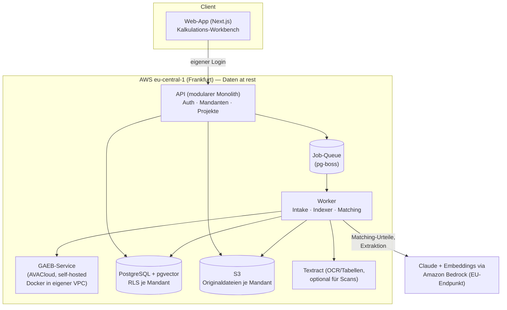

# Kalkulations-Assistent — Ziel-Architektur (v2, nach Agenten-Team-Review)

**Produkt:** SaaS für Bauunternehmen: Ausschreibung/LV in **beliebigem Format** hochladen (GAEB,
Excel, PDF, Word, formlose Anfrage) → Kalkulationsentwurf mit Preisvorschlägen aus der eigenen
Angebots-/Nachkalkulations-Historie, jeder Vorschlag mit Quellenverweis und Herleitung →
Export nach Excel/GAEB.

**Stand:** 24.07.2026, **Version 2.0** — geprüft durch ein Agenten-Team (3 Recherchen: Prozess,
Automatisierung, Techstack; je unabhängige Qualitätsprüfung mit Quellen-Stichproben; 33 Befunde
eingearbeitet). Befunde und Quellen: `2026-07-24-architektur-review-befunde.md`.
Strategiekontext: `2026-07-24-galant-second-brain-dsgvo.md`.

---

## 1. Architektur-Leitplanken (nicht verhandelbar)

1. **EU-Verarbeitung by design — präzise formuliert.** Daten at rest (RDS, S3, Vektorindex)
   liegen nachweislich in **eu-central-1 (Frankfurt)**. Die Claude-Aufrufe laufen über den
   **Bedrock-EU-Endpunkt** (+10 % Aufschlag): Verarbeitung innerhalb der AWS-EU-Geographie,
   je nach Kapazität auch UK/Schweiz (Drittländer **mit** EU-Angemessenheitsbeschluss) —
   „Frankfurt-only" gibt es für aktuelle Modelle auf Bedrock nicht. Genau so (und nicht
   schärfer) wird es in AVV und Vertrieb formuliert. Für Kunden mit Single-Region-Pflicht:
   eu-west-1 (Irland, In-region only) als dokumentierte Option. Bedrock-Zusagen bleiben:
   keine Speicherung der Prompts/Outputs, kein Training, keine Weitergabe an den Modellanbieter.
2. **Das LLM wählt und begründet — der Code rechnet.** Preisableitungen (Indexierung,
   Streubänder, Einheiten, Zuschläge, Summen) laufen ausschließlich in deterministischem Code.
   Claude entscheidet, *welche* Altposition passt — nie, *was* etwas kostet.
3. **Kein Vorschlag ohne Quelle.** Jeder Preisvorschlag referenziert eine konkrete Altposition;
   die Engine verifiziert Existenz und Einheitenkompatibilität. Ohne gültige Quelle: „manuell"
   statt Ratepreis. (Quellen-Grounding ist laut Marktanalyse die definierende Fähigkeit der
   Kategorie — Trunk Tools, Vergabescanner, GAEB-Online-Preisprotokolle.)
4. **Formatoffen — kein Format ist Voraussetzung.** GAEB ist der beste Fall, nicht die
   Eintrittskarte. **Achtung, als Hypothese markiert:** „Excel-Kalkulierer sind im Mittelstand
   die Mehrheit" ist durch keine Statistik belegt (Bitkom/PwC messen anderes; belastbare
   Excel-vs.-AVA-Quoten existieren nicht). Phase 0 misst je Design-Partner-Kandidat:
   AVA vorhanden ja/nein, Anteil GAEB vs. PDF/Excel im Eingang, Betriebsgrößenklasse.
   Das Ergebnis entscheidet die Segment-Priorität (Excel-Werkzeug vs. AVA-Zulieferer).
5. **Harte Mandantentrennung — mit Betriebsregeln.** `tenant_id` überall, Postgres-RLS mit
   `FORCE ROW LEVEL SECURITY`, Tenant-Kontext nur transaktionsgebunden (`SET LOCAL` /
   `set_config(..., true)` — nie Session-`SET` bei Connection-Pooling), App-Rolle ist nie
   Tabellen-Owner, kein `BYPASSRLS`; automatisierte Negativ-Tests („Mandant A sieht nie Zeilen
   von B") in der CI. Kein Cross-Tenant-Learning.
6. **Korrekturen sind Gold.** Jede Kalkulator-Aktion fließt als Ereignis ins Preisgedächtnis
   zurück — Lock-in und Qualitäts-Loop zugleich.
7. **Qualität wird gemessen, nicht behauptet.** Vor dem MVP entsteht ein **Gold-Set** aus
   echten Design-Partner-LVs mit bestätigten Zuordnungen. KPIs: Precision der „sicher"-Stufe
   ≥ 95–98 %, Coverage je Stufe, Alternativen-Trefferquote. Ein Eval-Harness läuft vor jedem
   Prompt-, Modell- oder Embedding-Wechsel. Bis die Precision gemessen ist, vergibt das System
   höchstens „prüfen" — „sicher" wird erst nach Nachweis freigeschaltet. (Literatur-Referenz:
   ~83 % Zuordnungs-Übereinstimmung ist State of the Art; ein einziger falscher „sicher"-Preis
   im Angebot beschädigt das Vertrauen dauerhaft.)

## 2. Prozessabdeckung — wo der Assistent im KMU-Kalkulationsablauf sitzt

Der reale Ablauf (nach KLR Bau und Praxisrecherche) und die ehrliche Abdeckung:

| # | Prozessschritt im KMU | Deckt V1 ab? | Ausbaupfad |
|---|---|---|---|
| 1 | **Anfrage kommt rein** (öffentlich: eVergabe/GAEB-Pflicht; privat: GAEB/PDF/Excel/Mail gemischt) → bieten oder nicht? Aufwand: 8–30 h je öffentlichem Angebot (>100 h komplex), Trefferquoten 20–30 %, teils <10 % | 🟡 Intake ja; Bid/No-Bid-Hilfe nein | „Anfrage-Check": LV-Zusammenfassung, Risiken, Frist — reiner LLM-Use-Case auf vorhandenen Daten; **Kandidat für Vorziehen** (s. Priorisierungskasten) |
| 2 | **Mengenermittlung/Aufmaß** (bei Anfragen ohne LV oft der größte Zeitblock) | 🔴 **Bewusster Scope-Ausschluss** (CAD-/Takeoff-Welt: Togal, STACK) | Intake kennt den Zustand „Menge fehlt — vom Nutzer zu ergänzen"; solche Anfragen zählen nicht als vollwertige LV-Fälle |
| 3 | **LV sichten:** Vorbemerkungen/Vertragsklauseln, Mengen plausibilisieren | 🟡 Positionsanalyse ja; Klausel-Check nein | „Vorbemerkungs-Check": Risiko-Klauseln markieren (Vertragsstrafen, Risikoüberwälzung) |
| 4 | **Preise bilden — in der Praxis eine Mischform je Position:** Erfahrungspreis aus Historie, Lohn über Aufwandswert × Mittellohn (Plümecke/SIRADOS), Material über tagesaktuelle Lieferantenpreise, NU-Anfragen | 🟢 Erfahrungspreis-Anteil = **Kernprodukt** · 🔴 Lohn-Detail/Material-Anfragen/NU nicht in V1 | NU-/Lieferanten-Preisspiegel als eigenes Modul; Positionstyp-Heuristik warnt bei materiallastigen Positionen (Preisvolatilität seit 2021/22) |
| 5 | **Nachunternehmer-Block:** NU-Anteil im Bauhauptgewerbe **41–43 % der Bauleistung** — NU-Preise sind tagesaktuell/marktgetrieben, aus eigener Historie kaum belastbar | 🔴 **Ehrliche Konsequenz: bei NU-lastigen LVs deckt V1 nur den Eigenleistungsanteil** | Positionen als `eigenleistung`/`nu_leistung` kennzeichnen, NU-Positionen default „manuell" mit Hinweis; Abdeckungsgrad je Pilot messen; NU-Preisspiegel-Priorität je Pilotprofil neu bewerten |
| 6 | **Zuschläge:** BGK, AGK, W&G (Zuschlagskalkulation = KMU-Standard; Endsummenkalkulation bei Großprojekten). Öffentlich ab ~50 T€: **EFB-Blätter 221/222/223 Pflicht** (Ausschlussrisiko) | 🔴 Nicht in V1 — aber das Schema speichert EP-Anteile von Tag 1 (s. Abschnitt 5), sonst wäre EFB später unmöglich | Deterministisches Zuschlagsmodul; EFB-Export als eigener Ausbauschritt für öffentliche Bieter |
| 7 | **Angebotsschluss & Abgabe:** Nachlass/Skonto, Angebotsschreiben; öffentlich X84 über Vergabeplattform, privat PDF/Excel | 🟡 Excel-Export ja; X84/EFB/Anschreiben später | X84-Export wird **an das Pilotprofil gekoppelt**: bietet ein Design-Partner überwiegend öffentlich, zieht er in den MVP-Umfang vor |
| 8 | **Verhandlung/Überarbeitung** (privat der Normalfall: Rev. 1/2/3, Nachlässe, Alternativpositionen) | 🔴 V1 einspurig — aber Datenmodell kennt **Angebotsversionen**; nur der beauftragte Stand wird „bestätigter Preis" | Versions-Workflow in der Workbench |
| 9 | **Nach Auftrag:** Arbeitskalkulation, Nachträge (Fortschreibung der Urkalkulation), **Nachkalkulation** — in KMU-Praxis notorisch vernachlässigt („kaum stemmbar") | 🟡 Nachkalkulations-*Import* ja, **sofern Daten existieren** (Erwartung gedämpft) | Nachtrags-Assistent; später niedrigschwelliger Ist-Daten-Import (Stundenzettel, Eingangsrechnungen), der eine Grob-Nachkalkulation *erzeugt* statt voraussetzt |

**Positionierung:**
- Für Firmen **mit** AVA (ORCA, iTWO, California, Nevaris, BRZ …): **Zulieferer** — LV rein,
  bepreister Entwurf zurück. Ersetzt die AVA nicht. Für öffentliche Submissionen ist V1 nur
  Zulieferer der AVA/des Bietertools (EFB/X84 kommen dort erst mit dem Ausbau).
- Für Firmen **ohne** AVA: wächst über den Ausbaupfad zum leichtgewichtigen Angebotswerkzeug.
- Welches Segment zuerst poliert wird, entscheiden die Phase-0-Messungen (Leitplanke 4).

> **Priorisierungslogik — warum Zuschlagsmodul und NU-Preisspiegel erst später kommen:**
> Der MVP muss genau eine Hypothese beweisen: *Preisvorschläge aus der eigenen Historie sparen
> dem Kalkulator Stunden, und er vertraut ihnen.* Alles im MVP dient diesem Beweis.
>
> **Zuschlagsmodul (BGK/AGK/W&G):** technisch einfach (deterministische Umlage, 1–2 Wochen) —
> aber jede Firma hat das schon; es differenziert nicht. Umlageverfahren sind zudem
> firmenindividuell (offene/verdeckte/spekulative Umlage) — halbrichtige Endpreise würden das
> Vertrauen beschädigen. Platz im Ausbaupfad, **vorziehbar in den MVP**, falls Phase 0 zeigt,
> dass die Piloten ohne Endpreise nicht arbeiten können.
>
> **NU-/Lieferanten-Preisspiegel:** ein Mehrparteien-Workflow (Anfragen, Fristen, eingehende
> Angebote in beliebigen Formaten, Vergleich), dessen Wert von antwortenden Dritten abhängt —
> im 3-Monats-Pilot nicht validierbar. Die Lohn-Detailkalkulation ist Kernkompetenz jeder
> AVA — nicht unser Feld. Datenlogisch wird der Preisspiegel besser, wenn er auf dem fertigen
> Preisgedächtnis aufsetzt. **Neu nach Review:** Bei Rohbau-/GU-Piloten (NU-Anteil 41–43 %)
> wird diese Priorität nach den ersten Abdeckungsmessungen erneut geprüft — und der
> **Anfrage-Check** ist wegen minimalem Aufwand und großem Schmerz (8–30 h/Angebot bei
> 20–30 % Trefferquote) ein Kandidat, um noch **vor** dem Zuschlagsmodul zu kommen.

## 3. Gesamtbild



Ein deploybarer Monolith + ein Worker + der GAEB-Service-Container. Keine Microservices, kein
Kubernetes — drei Container auf ECS Fargate reichen bis weit über 100 Kunden.

## 4. Frontend

- **Next.js** (App Router) auf Fargate. Betriebsregeln aus dem Review: **kein ISR/Filesystem-
  Cache** (bricht bei >1 Replica — die Workbench ist ohnehin dynamisch), `output: standalone`
  mit korrektem Kopieren von `public`/`.next/static` in der IaC-Vorlage, SSE-Timeouts an
  ALB explizit konfigurieren. CloudFront nur mit dokumentierter Begründung (TLS-Terminierung
  an Edge-Standorten auch außerhalb der EU) — für eine Login-App genügt ggf. der ALB in
  eu-central-1.
- **Login: better-auth** (Primärempfehlung nach Review): E-Mail/Passwort + Passkeys nativ,
  Organization-Plugin für B2B-Mandanten/Einladungen/RBAC, Daten in der eigenen Postgres,
  kein Anbieter-Lock-in. SSO später als generisches OIDC/SAML je Mandant (better-auth-SSO-
  Plugin oder vorgeschalteter Keycloak nur für Enterprise-Kunden).
- **Kern-Screen: die Kalkulations-Workbench.** Eine Zeile pro Position:
  | OZ | Kurztext | Menge/Einheit | **Vorschlag (EP)** | **Streuband** | **Quelle** | **Stufe** | Aktion |
  - *Vorschlag + Streuband:* neben dem Punktwert das min/median/max der Top-Kandidaten mit
    Jahr/Projekt — ehrlicher als Scheingenauigkeit (reale Angebotsstreuung liegt bei ±40 %).
  - *Quelle* verlinkt die Altposition; *Herleitung* zeigt jeden Rechenschritt
    („EP 2023: 41,20 € × Index 1,09 = 44,91 €" bzw. „Exact Match, unverändert").
  - *Stufe*: `sicher` / `prüfen` / `manuell`. Extraktions-Auffälligkeiten (Arithmetik-Guards,
    Abschnitt 5) markieren die konkrete Zelle mit Diff Original ↔ Extraktion.
  - Jede Aktion (übernehmen, Alternative, eigener Preis) ist ein Korrektur-Ereignis.
- Fortschritt über Server-Sent Events; Läufe dauern Minuten — die UI ist asynchron gedacht.

## 5. Universal-Intake — jedes Format, ein Schema

**Kanonisches Positionsschema (v2 — nach Review erweitert):**

```
{ oz, kurztext, langtext, menge, einheit, gewerk,
  positionsart,          // normal | alternativ | bedarf | zulage | stundenlohn
  titel_pfad,            // Los/Titel/Untertitel-Hierarchie (Kontext!)
  ep, gp,
  ep_anteile: { lohn, stoff, geraet, nu, sonstiges },   // optional, ab Tag 1 mitgeschrieben
  aufwandswert,          // optional
  leistungstyp,          // eigenleistung | nu_leistung | unbekannt
  projekt_id, jahr, quelle_typ, embedding_version }
```

Warum die neuen Felder Pflicht sind: **GAEB-X84-Historien enthalten die EP-Anteile bereits** —
sie beim Import wegzuwerfen wäre ein später kaum reparierbarer Datenverlust und würde
EFB-Blätter (öffentliche Vergabe ab ~50 T€, Ausschlussrisiko) für immer ausschließen.
**Positionsart und Titel-Pfad** verhindern die häufigste Matching-Fehlerart: Eine Zulage
gegen eine Normalposition gematcht liefert absurde Preise; „Bordstein setzen" bedeutet je
Titelkontext (Tiefgarage vs. Gehweg) Verschiedenes.

| Eingangsformat | Verarbeitung | Max. Stufe |
|---|---|---|
| **GAEB X81/X83/X84** (XML 3.2/3.3) | **AVACloud (Dangl IT), self-hosted als Docker-Container in der eigenen VPC** — deckt auch GAEB 90/2000 ab, Node-Client vorhanden. (Kein nativer Node-Parser existiert; Eigenbau höchstens für X8x-XML, GAEB 90 nie selbst bauen. Alternative: Python-Sidecar mit pyGAEB — Dialekt-Abdeckung gegen echte Dateien testen. Lizenzkosten AVACloud: zu verifizieren) | `sicher` möglich |
| **Excel-LV** (jede Spaltenanordnung) | Mapping-Assistent: Claude erkennt Spalten → Nutzer bestätigt einmal → deterministischer Import. Mapping je Absender/Dateityp gemerkt — **mit Struktur-Fingerprint** (Hash über Header/Spaltenzahl/Typen): weicht eine neue Datei ab → Re-Bestätigung, bis dahin „prüfen" | `sicher` (nach bestätigtem Mapping + Fingerprint-Match) |
| **PDF-LV** | pdftotext-first; für Scans **Textract (eu-central-1, Deutsch, Tabellenstruktur) als deterministische Vorstufe**, Claude bekommt Text + Tabellengeometrie; Vision nur als Fallback (Fotos/Handschrift) | `prüfen` |
| **Word / formlose Anfrage** | Claude extrahiert Positionsliste, Nutzer bestätigt; ohne Mengen → Zustand „Menge fehlt" | `prüfen` |
| **Foto/Scan** | Textract/Vision → Extraktion → Bestätigung | `prüfen` |

**Pflicht-Guards im Intake (deterministisch, nach Review):**
- **Arithmetik-Konsistenz:** GP = EP × Menge je Zeile, Titelsummen = Summe der Positionen,
  Einheiten gegen Whitelist. Jede Verletzung markiert die konkrete Position in der Workbench —
  500 Positionen manuell gegenlesen würde die Zeitersparnis auffressen.
- **Historie-Import:** Summenprüfung gegen die Angebotsendsumme als Abnahmekriterium.
- **Onboarding zeigt eine Historien-Abdeckungsanalyse:** welche Gewerke/Zeiträume fehlen —
  der Kaltstart wird sichtbar statt frustrierend.

## 6. Das Preisgedächtnis — Matching-Pipeline (der Kern)

**Stufe 1 — Kandidaten holen (Retrieval, kein LLM):** Hybrid-Suche über die Mandanten-Historie:
pgvector-Embeddings + Postgres-Volltext + harte Filter (Einheit, Gewerk, Mengenband,
**Positionsart**). Neu nach Review:
- **Filter-Relaxation als Kaskade:** liefert die strenge Suche < k Kandidaten (dünne Historie!),
  werden Gewerk/Mengenband zu Ranking-Boosts abgeschwächt und die Position automatisch auf
  max. „prüfen" gedeckelt. Nur die Einheitenkompatibilität bleibt hart. Coverage mit/ohne
  Relaxation wird geloggt.
- **FTS-Härtung für Bau-Deutsch:** `german`-Stemmer zerlegt keine Komposita („Tiefbordstein"
  matcht „Bordstein" nicht) → pg_trgm plus bau-spezifische Synonym-/Komposita-Stammdatenliste.
- **Vor dem Embedding:** Abkürzungs-/Einheiten-Normalisierung (dieselbe Stammdatentabelle).

**Stufe 1.5 — Exact-Match-Kurzschluss (deterministisch, NEU):** normalisierter Text-Hash bzw.
identische STLB-/Katalognummer + gleiche Einheit → direkt `sicher` **ohne LLM-Call**, Herleitung
„Exact Match". Wiederkehrende Positionen (Stammkunden-LVs, STLB-Texte) sind der häufigste Fall —
das spart Kosten, Latenz und LLM-Fehlerfläche. Dokumentierte deterministische Ausnahme der
Regel „das LLM kann nie heraufstufen".

**Stufe 2 — Urteil (Claude, Structured Output):** pro verbleibender Position, mit
**Titel-Pfad als Kontext** im Prompt und Positionsart-Guards (Zulage nur gegen Zulage,
Stundenlohn eigener Pfad, Alternativ-/Bedarfspositionen markiert und aus Summen gehalten):

```json
{
  "match_quelle_id": "hist_... | null",
  "stufe": "sicher | pruefen | manuell",
  "begruendung": "1-2 Sätze",
  "alternativen": ["hist_...", "hist_..."],
  "anpassungs_hinweise": {"jahr_differenz": true, "mengen_differenz": "groesser"}
}
```

**Konfidenz ist ein Signal-Ensemble, keine LLM-Selbstauskunft** (verbalisierte
LLM-Konfidenz ist nachweislich überkonfident): Retrieval-Score, Margin zwischen Kandidat 1
und 2, Übereinstimmung LLM-Wahl ↔ Top-Retrieval, Einheiten-/Mengenkompatibilität. Schwellen
werden je Gewerk aus dem Gold-Set kalibriert; bis dahin gilt Leitplanke 7 (konservativer Start).

**Stufe 3 — Preis ableiten (Code, deterministisch):**
- Baupreisindex-Anpassung (Destatis-Reihen je Leistungsbereich, quartalsweise, als Stammdaten).
- **Positionstyp-Heuristik:** materiallastige Positionen (über Gewerk/ep_anteile erkannt)
  erhalten eine explizite Volatilitäts-Warnung bzw. konservativere Stufe — der Gewerke-Index
  mittelt Lohn- und Materialentwicklung und kann bei Material seit 2021/22 deutlich danebenliegen.
- **Mengensprung-Guard (hart):** Faktor > 5 zwischen Alt- und Neumenge → max. „prüfen"
  (Skaleneffekte machen den Alt-EP unbrauchbar).
- **Streuband** min/median/max der Top-Kandidaten wird immer mitberechnet und angezeigt.
- Optionale Regionalfaktor-Stammdatentabelle (Muster sirAdos-Ortsfaktoren) ist im Datenmodell
  vorgesehen, bleibt im MVP leer.
- Jeder Rechenschritt wird als Herleitung gespeichert und angezeigt.

**Guards:** Quelle muss existieren und einheitenkompatibel sein, sonst „manuell";
`nu_leistung`-Positionen default „manuell" mit Hinweis; das LLM-Urteil kann Stufen nur
bestätigen oder senken (einzige Ausnahme: deterministischer Exact-Match, Stufe 1.5).

## 7. LLM- und Embedding-Schicht

- **Zugang:** Amazon Bedrock über den offiziellen Bedrock-Mantle-Client (`anthropic.`-Präfix),
  **EU-Endpunkt** (+10 %). Modell-/Endpunkt-Wahl ist Konfiguration je Umgebung, nie hartkodiert.
- **Modellwahl konkret (nach Review):** Start mit **Opus-Klasse** (`anthropic.claude-opus-4-8`)
  für Matching-Urteile — Fehlerkosten einer falschen Zuordnung rechtfertigen das beste Modell.
  Im Pilot **A/B gegen Sonnet-Klasse messen** (Intro-Preis bis 08/2026 nutzen); Haiku-Klasse als
  Kandidat für die nach Stufe 1.5 verbleibenden einfachen Fälle. Der Eval-Harness (Leitplanke 7)
  entscheidet, nicht das Bauchgefühl.
- **Structured Outputs** (`output_config.format`, auf Bedrock GA): Schemas ohne rekursive
  Strukturen und numerische Constraints (API-Einschränkung — Wertebereichsprüfungen wie
  „Menge > 0" macht der deterministische Code), `additionalProperties: false`, **Schemas stabil
  halten** (24-h-Grammar-Cache).
- **Prompt-Caching:** stabiler Präfix (System-Prompt + Firmenregeln + Stammdaten), volatile
  Position ans Ende. **5-Minuten-TTL als Default** (Batch-Läufe rufen im Sekunden-/Minutentakt —
  der 2×-Schreibaufschlag der 1h-TTL lohnt erst bei gemessenen Lücken > 5 min; 1h-Verfügbarkeit
  fürs Zielmodell auf Bedrock: zu verifizieren).
- **Kosten-Größenordnung:** ~2–2,5 ct pro LLM-geprüfter Position (neuer Tokenizer ≈ +30 %
  Token, EU-Endpunkt +10 % eingerechnet); ein 500-Positionen-LV bleibt bei **≤ 10 €** — durch
  Stufe 1.5 real deutlich darunter. Token-Budget je Mandant.
- **Embeddings — messbare Entscheidung statt Bauchgefühl:** Kandidat 1 ist **Cohere Embed v4**
  (multilingual, über das EU-Cross-Region-Profil `eu.cohere.embed-v4:0`); Gegenkandidat ein
  selbst gehostetes **BGE-M3 / multilingual-e5** in eu-central-1 (dann echtes Frankfurt-only
  fürs Retrieval). Entscheidung per Mini-Benchmark: Recall@10/20 auf 200–500 echten
  LV-Positionspaaren der Design-Partner (Komposita-Fälle wie „Tiefbordstein" gezielt rein).
  `embedding_version` wird je Eintrag gespeichert — Re-Embedding ist ein eingeplanter Pfad.
  (Titan-V2-Verfügbarkeit in Frankfurt: nicht belegt, zu verifizieren.)
- **Eigene Job-Queue statt Batch-API** (gibt es auf Bedrock nicht): pg-boss mit kontrollierter
  Parallelität. Bewusster Trade-off: Residenz schlägt Rabatt.
- **Beobachtbarkeit:** `llm_runs`-Tabelle (Mandant, Position, Modell, Token, Dauer, Stufe).

## 8. Preisgedächtnis-Pflege & Feedback-Loop (der Burggraben)

Nach Review geschärft — append-only allein erzeugt eine Echo-Kammer:

- **Cluster statt flacher Liste:** `history_positions` gruppiert gleiche Leistungen zu einer
  kanonischen Position mit **Preiszeitreihe**; das Retrieval liefert je Cluster einen
  Repräsentanten. Verhindert, dass Selbstkopien übernommener Vorschläge nach Monaten die
  Top-10 dominieren und Preise „versteinern".
- **Herkunft + Status ab Tag 1:** `herkunft` (original_import | uebernahme | nachkalkulation)
  und `angebotsstatus` (angeboten | beauftragt | verloren) je Eintrag — im Ranking gewichtet.
  Preise verlorener Angebote dürfen nicht gleichwertig einfließen wie beauftragte. (Kostet im
  MVP fast nichts, ist nachträglich kaum rekonstruierbar.)
- **Angebotsversionen:** `projects` kennt Revisionen; nur der **beauftragte Stand** fließt als
  „bestätigter Preis" zurück — nicht der unverhandelte Erstentwurf.
- **Nachkalkulations-Import:** bleibt der Qualitätssprung (Ist- statt Angebotspreise), aber mit
  gedämpfter Erwartung („sofern vorhanden" — KMU-Nachkalkulation ist notorisch selten). Der
  Import-Pfad wird im MVP mit einem Design-Partner einmal real durchgespielt, damit
  `quelle_typ = nachkalkulation` von Anfang an befüllbar ist.
- **Kaltstart-Strategie (Entscheidung nach Review):** Das Datenmodell sieht eine klar
  gelabelte vierte Vorschlagsquelle **„Marktpreis (extern)"** vor (`quelle_typ`-Erweiterung) —
  lizenzierbare Standard-Preisdatenbanken (sirAdos, DBD-BauPreise, BKI) als optionales,
  gekennzeichnetes Add-on für Neukunden mit dünner Historie. Im MVP wird die Quelle **nicht
  lizenziert**, aber das Schema ist vorbereitet; die Historien-Abdeckungsanalyse (Abschnitt 5)
  macht die Lücke sichtbar. Firmenpreise und Marktpreise werden nie vermischt dargestellt.
- **Kein Modell-Training, keine Cross-Tenant-Nutzung.** Anonymisierter Benchmark-Pool bleibt
  ein späteres Opt-in-Feature.

## 9. Qualitätssicherung (NEU — Leitplanke 7 operationalisiert)

1. **Gold-Set:** echte LVs der Design-Partner mit von Kalkulatoren bestätigten Zuordnungen;
   wächst mit jedem Pilot-Lauf (die `events`-Tabelle liefert die Labels).
2. **KPIs:** Precision „sicher" ≥ 95–98 %, Coverage je Stufe, Alternativen-Trefferquote,
   Coverage mit/ohne Filter-Relaxation, Exact-Match-Quote.
3. **Eval-Harness:** läuft vor jedem Prompt-/Modell-/Embedding-/Schwellen-Wechsel gegen das
   Gold-Set; Ergebnisse versioniert neben `llm_runs`.
4. **Freischalt-Regel:** „sicher" wird je Mandant/Gewerk erst vergeben, wenn die gemessene
   Precision die Schwelle hält — vorher höchstens „prüfen".

## 10. Datenmodell (Kern-Tabellen, v2)

| Tabelle | Inhalt |
|---|---|
| `tenants`, `users` | Mandanten, Nutzer (better-auth-Konten; optionales SSO-Subject), Rollen |
| `projects` | LV-Vorgang **mit Angebotsversionen** (Rev. 1..n, Status: entwurf/abgegeben/beauftragt/verloren) |
| `lv_positions` | eingelesene Positionen (kanonisches Schema v2 inkl. positionsart, titel_pfad, quelle_typ, Roh-Referenz) |
| `history_positions` | Preisgedächtnis: **Cluster + Preiszeitreihe**, ep_anteile, herkunft, angebotsstatus, embedding_version |
| `matches` | Vorschlag je Position: Quelle, Stufe, Signal-Ensemble, Begründung, Herleitung, Streuband, Status |
| `events` | Korrektur-/Freigabe-Ereignisse (append-only) — zugleich Gold-Set-Labelquelle |
| `import_mappings` | bestätigte Spalten-Mappings je Mandant/Absender **+ Struktur-Fingerprint** |
| `price_indices` | Baupreisindex-Reihen je Leistungsbereich/Quartal; optionale Regionalfaktoren |
| `stammdaten_normalisierung` | Einheiten-, Abkürzungs-, Synonym-/Komposita-Listen (Intake, FTS, Embedding) |
| `llm_runs` | Modell, Token, Kosten, Latenz, Stufe je Aufruf |
| `eval_runs` | Gold-Set-Ergebnisse je Prompt-/Modell-/Embedding-Stand |

Alle Mandanten-Tabellen: `tenant_id` + RLS-Policy nach den Betriebsregeln aus Leitplanke 5;
pgvector ≥ 0.8 (iterative Index-Scans wegen gefilterter ANN-Suche; RDS-Versionsstand zu
verifizieren), bei wachsenden Mandanten Partitionierung nach `tenant_id`. Originaldateien in
`s3://…/{tenant_id}/…`. OpenSearch/Qdrant erst ab ~10 Mio.+ Vektoren ein Thema.

## 11. DSGVO & Betrieb

- **Datenfluss:** at rest komplett eu-central-1; LLM-/Embedding-Inferenz über Bedrock-EU-
  Endpunkt (AWS-EU-Geographie, ggf. UK/CH — Angemessenheitsbeschlüsse). Genau diese zwei Sätze
  gehören in AVV und Vertriebsmaterial — nicht mehr, nicht weniger.
- **Verträge:** AVV mit AWS (deckt Bedrock); eigene AVV-Vorlage für Kunden; Bausteine aus dem
  Galant-Papier. Subprozessoren-Liste: AWS.
- **Löschkonzept als Feature:** „Mandant löschen" = DB + S3-Präfix + Index in einem Job, mit
  Protokoll.
- **Backups:** RDS-Snapshots (EU), S3-Versionierung, Wiederherstellungsprobe vor dem ersten
  zahlenden Kunden.
- **IaC von Tag 1** (Terraform/CDK); RLS-Negativ-Tests in der CI (Leitplanke 5).

## 12. MVP-Schnitt vs. Ausbau

**Im MVP (Monat 1–3):**
Monolith + Worker + AVACloud-Container, better-auth-Login, Universal-Intake (GAEB via AVACloud +
Excel-Mapping-Assistent mit Fingerprint + PDF/Textract) **mit Arithmetik-Guards**, Historie-Import
mit Abdeckungsanalyse (Schema v2 inkl. ep_anteile/positionsart/titel_pfad von Tag 1),
Matching-Pipeline inkl. **Stufe 1.5 Exact-Match** und Filter-Relaxation, Workbench mit Streuband,
Excel-Export, Ereignis-Loop, **Gold-Set + Eval-Harness (Minimalversion)**, Mandanten-RLS,
Löschjob.

**Bewusst NICHT im MVP:**
GAEB-90-Import nur falls AVACloud ihn nicht abdeckt (deckt er ab), X84-Export (außer ein
Design-Partner bietet überwiegend öffentlich — dann vorziehen), Zuschlagsmodul,
Vorbemerkungs-/Anfrage-Check, NU-Preisspiegel, Marktpreis-Lizenz, Projekt-Ampel,
Self-Service-Registrierung, Modell-Stufung nach Kosten (erst nach Eval-Daten).

**Ausbaupfad (Reihenfolge nach Kundenschmerz — Phase 0 kann sie umsortieren):**
1. **Zuschlagsmodul** (deterministisch) — vorziehbar, s. Priorisierungskasten.
2. **Anfrage-Check** (Bid/No-Bid-Hilfe) — minimaler Aufwand, großer dokumentierter Schmerz;
   Kandidat, um vor 1. zu rutschen.
3. **Nachkalkulations-/Ist-Daten-Import** — schließt den Soll-Ist-Kreis.
4. **Vorbemerkungs-Check** (Risiko-Klauseln).
5. **X84-/EFB-Export** für öffentliche Bieter (das Schema kann es dann bereits).
6. **NU-/Lieferanten-Preisspiegel** — Priorität steigt bei Rohbau-/GU-Piloten.
7. **Marktpreis-Add-on** (sirAdos/DBD/BKI-Lizenz) für Kaltstart-Kunden.
8. **Projekt-Ampel** (läuft auf demselben Preisgedächtnis), danach Wetter/Kran als Widget.

## 13. Bekannte Bordsteinkanten & offene Verifikationspunkte

1. **GAEB ist ein Dialekt-Sumpf** — AVACloud entschärft das, aber: Lizenz-/On-Prem-Konditionen
   anfragen (zu verifizieren); Fixture-Sammlung aus echten Kundendateien bleibt Pflicht.
2. **Die Historie ist der Engpass, nicht das Modell** — Import-Assistent und
   Abdeckungsanalyse entscheiden über Time-to-Value.
3. **Excel-LVs sind chaotischer als Excel-Historien** (verbundene Zellen — SheetJS löst sie
   nicht auf, exceljs ergänzen; Zwischensummen, zweizeilige Positionen) — Testsammlung nötig.
4. **Einheiten-/Abkürzungs-Chaos** — Normalisierungs-Stammdaten speisen Intake, FTS und
   Embedding gleichermaßen.
5. **Baupreisindex ist eine Näherung** — Streuband und Herleitung immer zeigen; bei
   materiallastigen Positionen warnt die Heuristik.
6. **Bedrock-Verfügbarkeitsverzug** — Modell-IDs, Endpunkt-Typ, 1h-Cache-TTL und
   Embedding-Regionen sind Konfiguration; vor jedem Upgrade prüfen (zu verifizieren:
   Titan-Frankfurt, 1h-TTL fürs Zielmodell, exakte EU-Routing-Regionen).
7. **NU-Abdeckungsgrenze** — bei Rohbau-/GU-LVs deckt V1 strukturell nur den
   Eigenleistungsanteil; je Pilot messen und offen kommunizieren.

---

## Änderungsprotokoll v2 (Agenten-Team-Review, 24.07.2026)

Wichtigste Änderungen gegenüber v1 — vollständige Befundliste mit Quellen in
`2026-07-24-architektur-review-befunde.md`:

1. EU-Aussage präzisiert (Bedrock-EU-Endpunkt statt „Frankfurt-only"; +10 %; at rest ≠ Inferenz).
2. GAEB-Parser-Entscheidung: AVACloud self-hosted (kein nativer Node-Parser existiert).
3. Schema v2: ep_anteile, aufwandswert, positionsart, titel_pfad, leistungstyp,
   embedding_version — EFB-/Nachtragsfähigkeit und Matching-Kontext gesichert.
4. NU-Realität (41–43 %): ehrliche Abdeckungsaussage, `nu_leistung`-Kennzeichnung.
5. Excel-Mehrheits-These als Phase-0-Hypothese markiert, Messkriterien definiert.
6. Neue Leitplanke 7 + Abschnitt 9: Gold-Set, Precision-KPIs, Eval-Harness,
   konservative „sicher"-Freischaltung.
7. Stufe 1.5 Exact-Match (deterministisch, ohne LLM) + Filter-Relaxation + Signal-Ensemble
   statt LLM-Selbstkonfidenz.
8. Preisableitung: Streuband, Mengensprung-Guard, Materialpreis-Heuristik, Regionalfaktoren.
9. Preisgedächtnis: Cluster/Preiszeitreihen, Herkunft- und Gewonnen/Verloren-Status,
   Angebotsversionen; Kaltstart-Pfad „Marktpreis (extern)" vorgesehen.
10. Intake: Arithmetik-Guards, Mapping-Fingerprint, Textract-Vorstufe, Abdeckungsanalyse.
11. Betrieb: better-auth festgelegt, Next.js-/CloudFront-Fallstricke, RLS-Betriebsregeln,
    pgvector-/FTS-Härtung (Komposita), Caching-TTL-Default 5 min, Kosten ~2–2,5 ct/Position.
12. Prozesskarte: Mengenermittlung, EFB, Verhandlung/Versionen ergänzt; Nachkalkulations-
    Erwartung gedämpft; Anfrage-Check-Priorität hochgestuft.
